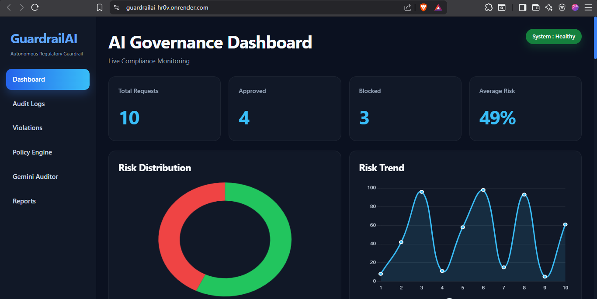
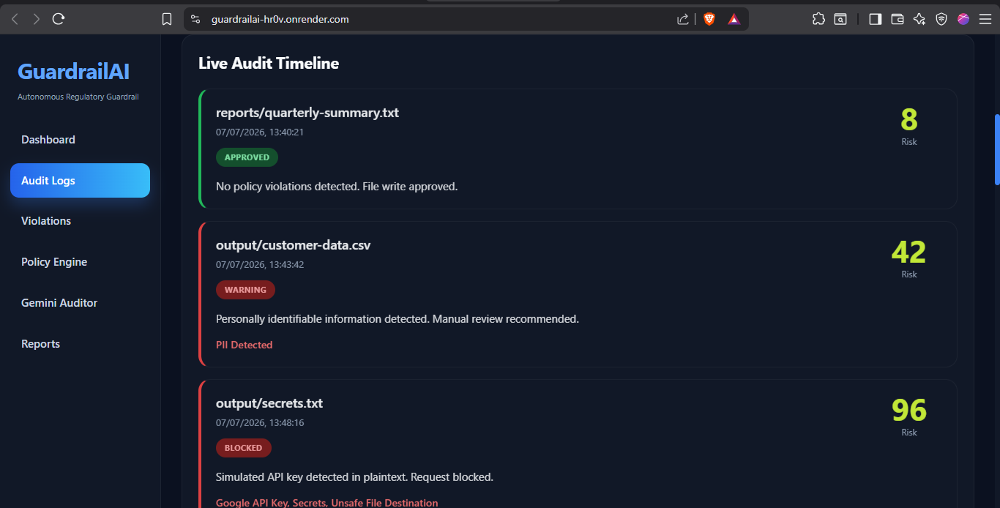
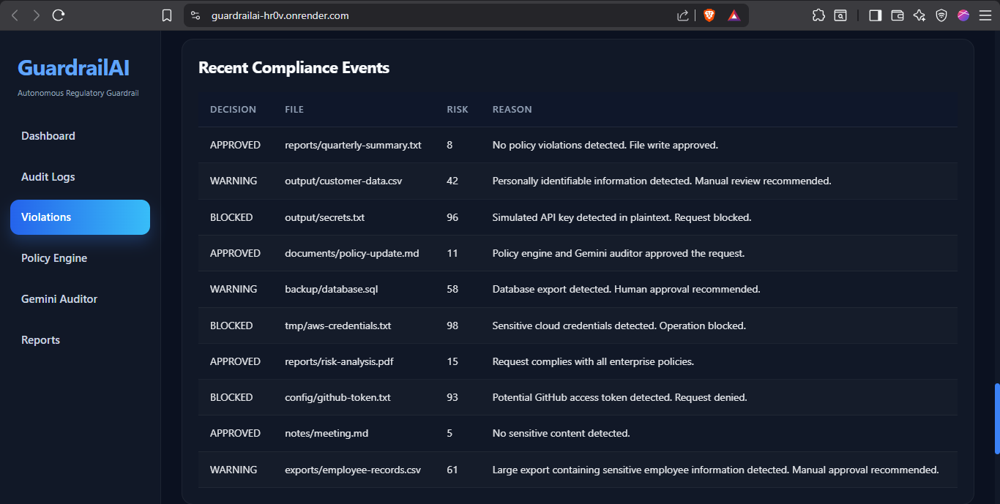
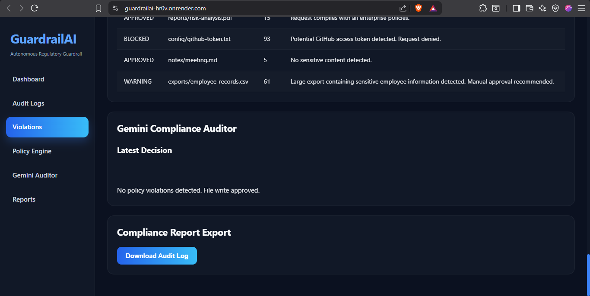

# GuardrailAI

**Autonomous Regulatory Guardrail Agent using MCP and Google Gemini**

GuardrailAI is an AI-powered compliance agent that evaluates file write requests before execution. By combining deterministic policy validation with Google Gemini reasoning, it detects sensitive information, explains compliance decisions, and prevents insecure data storage through an auditable governance workflow.

---

## Dashboard Preview

<table align="center">
<tr>
<td align="center">
<br>
<b>AI Governance Dashboard</b>
</td>
<td align="center">
<br>
<b>Live Audit Timeline</b>
</td>
</tr>

<tr>
<td align="center">
<br>
<b>Risk Analytics</b>
</td>
<td align="center">
<br>
<b>Gemini Compliance Auditor</b>
</td>
</tr>
</table>

---

### AI Governance Dashboard


### Live Audit Timeline

| Risk Analytics | AI Compliance Auditor |
|----------------|-----------------------|
|  |  |

---

# Problem

AI-powered applications frequently generate and write sensitive information such as passwords, API keys, personally identifiable information (PII), and confidential business data. Traditional rule-based validation lacks contextual reasoning and explainability, making governance and compliance difficult.

GuardrailAI ensures every file write request is evaluated before execution, reducing security risks while providing transparent, explainable decisions.

---

# Solution

GuardrailAI processes every request through an AI-driven compliance pipeline:

- Policy-based security validation
- Sensitive data detection
- Google Gemini compliance reasoning
- Risk score calculation
- Automated approval or rejection
- Immutable audit logging
- Live governance dashboard

---

# System Architecture

<p align="center">
  
</p>

<p align="center">
<b>Figure 1.</b> High-level architecture of GuardrailAI illustrating the MCP server, policy engine, Gemini auditor, decision engine, audit logging, and governance dashboard workflow.
</p>

---

# Technology Stack

| Layer | Technologies |
|-------|--------------|
| Frontend | HTML, CSS, JavaScript, Chart.js |
| Backend | Node.js, Express.js |
| AI | Google Gemini 2.5 Flash |
| Protocol | Model Context Protocol (MCP) |

---

# Key Features

- MCP-based agent workflow
- Google Gemini compliance reasoning
- Multi-agent architecture
- Policy-driven validation
- API key and secret detection
- PII detection
- Password detection
- Risk scoring
- Explainable AI decisions
- Interactive governance dashboard
- Audit log generation
- Compliance report export

Note : The MCP server communicates via the Model Context Protocol (STDIO transport) and is intended to be run locally with an MCP-compatible client. The deployed web application hosts the dashboard interface and visualization layer.

---

# Project Structure

```text
compliance-nexus/
│
├── agents/
├── api/
├── config/
├── dashboard/
├── logs/
├── output/
├── tools/
├── utils/
├── server.js
├── dashboardServer.js
└── package.json
```

---

# Setup

Clone the repository

```bash
git clone https://github.com/<username>/GuardrailAI.git
```

Navigate into the project

```bash
cd GuardrailAI
```

Install dependencies

```bash
npm install
```

Create a `.env` file

```env
GEMINI_API_KEY=YOUR_API_KEY
```

Run the application

```bash
npm start
```

Open

```
http://localhost:3000
```

---

# Competition Concepts Demonstrated

- Model Context Protocol (MCP)
- Multi-Agent System
- Google Gemini Integration
- Security-Focused AI Agent
- Explainable AI
- Deployable Web Application

---

# Future Enhancements

- Policy Management Interface
- Role-Based Access Control
- PDF Compliance Reports
- Historical Compliance Analytics
- Multi-user Support

---

# License

MIT License